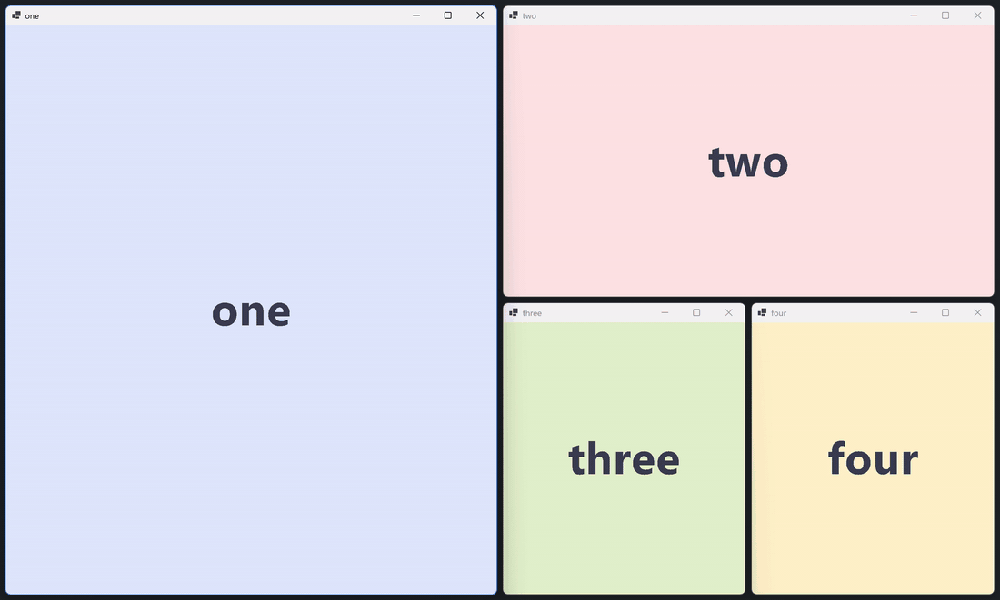
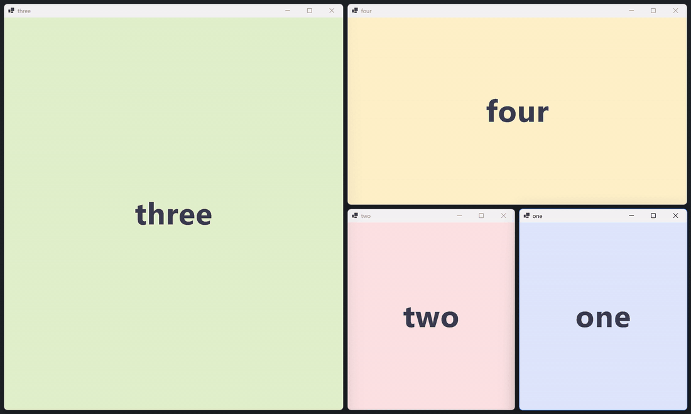
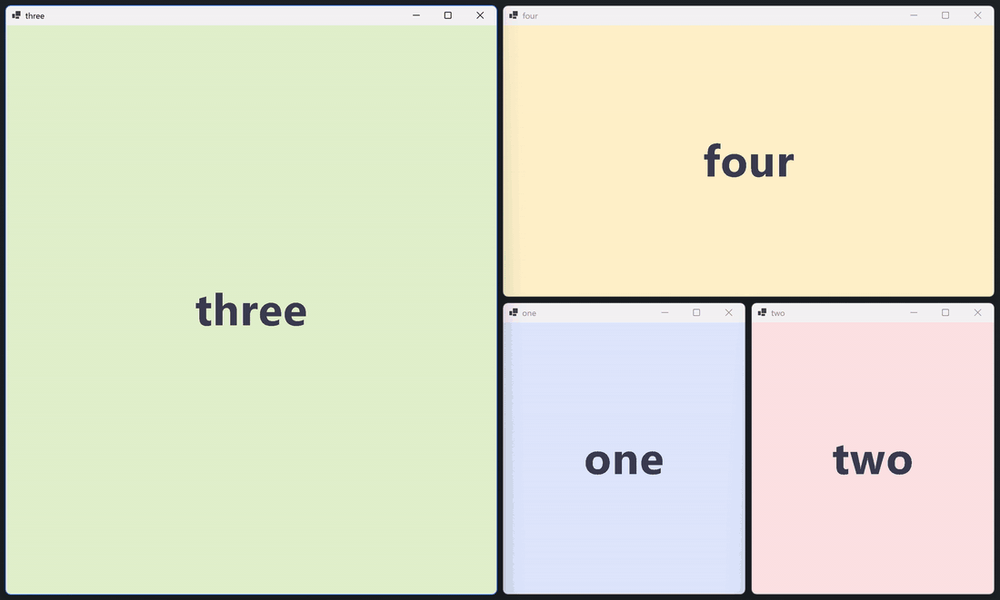
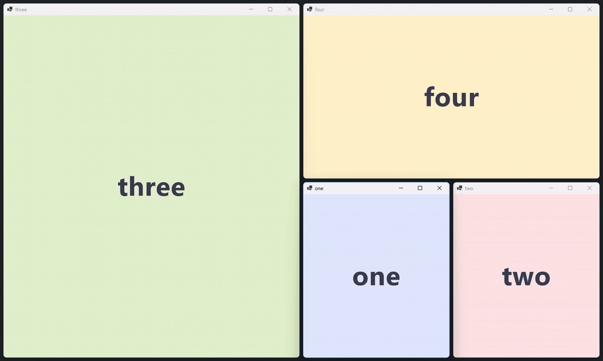

# YTile

A tiling window manager for Windows. C#, .NET 10, NativeAOT. Tiling only — no bar, no widgets.

YTile is an independent, from-scratch implementation informed by a study of
[komorebi](https://github.com/LGUG2Z/komorebi)'s behavior and architecture. No komorebi code is
copied into YTile.
See [docs/komorebi-architecture-digest.md](docs/komorebi-architecture-digest.md) for the study and
[docs/language-decision.md](docs/language-decision.md) for why C#/NativeAOT and the v0.1 roadmap.


## Design pillars

- **Single-actor state.** One thread owns all window-manager state and consumes one message
  queue fed by OS events, IPC commands, and timer ticks. No shared mutexes.
- **Narrow event capture.** WinEvent hooks are registered only for the ranges the manager
  consumes; the hook callback never blocks (bounded drop-oldest channel + resync on overflow).
- **DWM-native chrome.** Focus indication via `DWMWA_BORDER_COLOR` — no overlay border windows.
- **AOT-first.** Developed on the JIT, shipped NativeAOT. `DisableRuntimeMarshalling` and
  CsWin32 with `allowMarshaling: false` from the first commit; both binaries publish AOT.
- **Quirks as data.** Per-application Windows quirks live in a declarative table consulted at
  defined pipeline points, not as special cases threaded through event handling.

## What it does

Nine workspaces per monitor, hidden by cloaking rather than minimising so
alt-tab stays clean. BSP (dwindle) and Columns layouts, plus monocle. Focus and
movement are directional and continue onto the adjacent monitor at the edge.
Drag a window onto another to swap them, or drag an edge to resize — the new
size folds into the layout and survives retiles. Windows too large for their
cell float automatically instead of overlapping their neighbours, and per-app
rules can force either behaviour. Monitors can be hot-plugged. The Windows
taskbar can be hidden outright, with the reclaimed strip tiled over. Status bars
talk to it over a named-pipe NDJSON API they can subscribe to and reserve screen
edges through ([docs/YTILE-IPC.md](docs/YTILE-IPC.md)).

## In action

Directional focus and moving windows around the layout:



Keyboard resizing — the new size folds into the layout and survives retiles:



Dragging an edge does the same, live:



Monocle and sending windows between workspaces:



## Install

```powershell
irm https://raw.githubusercontent.com/AegiosOT/YTile/main/scripts/install.ps1 | iex
```

Downloads the latest release into `%LOCALAPPDATA%\Programs\ytile`, adds it to
your user PATH, and writes a starter config if you don't have one. Per-user, no
admin rights, nothing outside your profile. Options go in the environment,
since a piped script takes no parameters:

```powershell
$env:YTILE_AUTOSTART = 1    # also start YTile at login
$env:YTILE_START     = 1    # start the daemon when the install finishes
$env:YTILE_VERSION   = 'v0.1.0'   # pin a version instead of latest
$env:YTILE_UNINSTALL = 1    # remove YTile (config is left alone)
```

Re-run it any time to upgrade — it stops a running daemon first, since the
binaries are locked while it runs. Hotkeys come from the bundled
[YKeys](https://github.com/AegiosOT/YKeys) daemon: `ytile start` brings it up
automatically with bindings from `~/.config/ykeys/ykeys.json` (a starter is
written for you). Prefer [whkd](https://github.com/LGUG2Z/whkd)? Set
`$env:YTILE_HOTKEYS = 'whkd'` before installing, or use `ytile start --whkd`
(see [examples/whkdrc-ytile](examples/whkdrc-ytile)); `--no-hotkeys` starts
neither.

## Building

Requires the .NET 10 SDK, plus VS Build Tools with the C++ workload for the
NativeAOT linker.

```
dotnet build                # dev build (JIT)
pwsh scripts/publish.ps1    # NativeAOT ytiled.exe + ytile.exe -> publish/
```

## Running

```
ytile start              # launch ytiled in the background
                         #   (logs to %LOCALAPPDATA%\ytile\ytiled.log)
ytile start --elevated   # ...as administrator, so elevated windows tile too
ytile autostart on       # launch it at every login (ytile autostart off|status)
ytile autostart on --elevated   # ...elevated, via a highest-privilege logon task

ytiled                   # or run it in the foreground (auto-pauses if komorebi.exe is running)
ytiled --dry-run         # log every SetWindowPos/focus instead of applying it
ytiled --force           # manage even while komorebi is running (they will fight)
ytiled --debug-events    # watch the window-event stream with tiling verdicts

ytile state              # monitors, windows, layout, focus
ytile focus left         # directional focus
ytile move right         # swap focused window in a direction
ytile resize left 80     # grow the focused window 80px leftward (negative shrinks)
ytile workspace 2        # switch the focused monitor's workspace (1-9)
ytile send 3             # send the focused window to a workspace
ytile layout columns     # bsp | columns, per active workspace
ytile float              # toggle floating for the focused window
ytile monocle            # fullscreen the focused window within the layout
ytile reload             # re-read the config (e.g. after toggling hideTaskbar)
ytile pause / resume / retile / stop
```

Windows that refuse to shrink to their cell (launchers like Battle.net enforce a
minimum size) are detected automatically and float instead of overlapping the layout.

Dragging a tiled window's edge resizes it for real: the new size is folded into
the layout (per-split ratios in BSP, per-column weights in Columns) and survives
retiles. `ytile resize <dir> [px]` does the same from the keyboard (`resizeStep`
sets the default amount); `ytile retile` resets all adjustments.

## Configuration

`~/.config/ytile/ytile.json` (see [examples/ytile.json](examples/ytile.json); all keys optional):

```json
{
  "gap": 8,
  "focusBorderColor": "#FFFFFF",
  "defaultLayout": "bsp",
  "resizeStep": 50,
  "hideTaskbar": false,
  "rules": [
    { "match": "exe", "pattern": "Battle.net.exe", "action": "float" },
    { "match": "title", "pattern": "Picture.in.[Pp]icture", "strategy": "regex", "action": "float" }
  ]
}
```

### Hotkeys

Keys are handled by [YKeys](https://github.com/AegiosOT/YKeys), a separate
hotkey daemon that ships inside every YTile release and starts with
`ytile start`. Its config (`~/.config/ykeys/ykeys.json`) maps chords to
command lines — `"alt+1": "ytile workspace 1"` — and any program can be
bound, not just ytile. Chord syntax, key names, and details are in the
[YKeys README](https://github.com/AegiosOT/YKeys#readme); config changes
apply live, and a chord some other program already owns is skipped with a
log line in `%LOCALAPPDATA%\ykeys\ykeys.log`.

Windows reserves chords like `Win+Q` and `Win+E` for itself, and YKeys will not
steal a chord another program registered first. `ykeys shell-hotkeys` hands the
`Win+`*letter* ones back when you ask it to — YTile itself never modifies your
shell hotkeys. See the [YKeys README](https://github.com/AegiosOT/YKeys#readme).

Prefer [whkd](https://github.com/LGUG2Z/whkd)? `ytile start --whkd` runs it
instead of ykeys — see [examples/whkdrc-ytile](examples/whkdrc-ytile) — and
`ytile start --no-hotkeys` runs neither.

### Hiding the taskbar

`hideTaskbar` (default `false`) hides the shell taskbar outright and tiles over
the space it occupied — the Hyprland-style "the bar is simply not there", rather
than Windows' auto-hide, which still reveals on hover. Hiding the tray window
does not change the work area (Windows keeps reserving the strip), so YTile
switches to full monitor bounds while the bar is gone; a status bar's `reserve`
still applies on top of that.

The taskbar comes back whenever YTile is not managing: on `stop`, on `pause`,
and — because a killed daemon never runs its cleanup — on the next start, from a
marker file. If the shell restarts and recreates the taskbar, YTile notices
within a couple of seconds and hides it again. Toggle it live by editing the
config and running `ytile reload`.

Auto-hide needs no setting at all: Windows already reports the reclaimed space
in the work area, and layouts follow it.

Rules match on `exe`/`class`/`title` with `equals` (default), `prefix`, or `regex`
strategies; actions are `ignore` and `float`. `ytile reload` applies changes live.

Ignored built-in, so they float on top instead of disturbing the layout:
status bars (komorebi-bar, ybar, zebar, yasb), the Windows Security prompt
(Hello PIN, passkeys, smart cards), and installers — `msiexec.exe`, the MSI
and Inno Setup wizard windows, and the usual naming conventions
(`setup.exe`, `App-1.2-setup.exe`, `unins000.exe`). An installer these miss
can be added with a rule of your own.

## Elevated windows

Windows will not let a program move a window belonging to a process at a higher
integrity level. Task Manager auto-elevates on an administrator account, so an
ordinary YTile refuses to tile it — `SetWindowPos` fails with `ERROR_ACCESS_DENIED`
and the window never budges. This is a Windows access check, not something YTile
can work around.

YTile does not pretend otherwise. A window it is forbidden to move is floated
rather than left holding a slot in the layout, with the reason in the log:

```
float 0x001E0C3E Taskmgr.exe — elevated window — restart with 'ytile start --elevated' to tile it
```

Run the daemon elevated and those windows tile like any other:

```
ytile start --elevated          # one UAC prompt now
ytile autostart on --elevated   # registers a logon task at run level HIGHEST,
                                # so there is no prompt at login (registering it
                                # needs an admin terminal once)
```

The daemon logs which mode it is in at startup (`elevated: yes` / `elevated: no`).
The CLI and the ykeys hotkey daemon keep working unelevated against an elevated
daemon — YTile grants its own user access to the control pipe explicitly, because
an elevated process's default ACL would otherwise lock out the very CLI that
drives it.

## Code signing

Release binaries are Authenticode-signed by CI under the publisher
**NineFiveB** — details in [packaging/signing](packaging/signing/README.md).
## License

MIT — see [LICENSE](LICENSE). (Releases up to v0.1.3 were published under
GPL-3.0; everything from v0.1.4 on is MIT.)

One carve-out: [docs/komorebi-architecture-digest.md](docs/komorebi-architecture-digest.md)
quotes short fragments of komorebi's comments and log strings as attributed
citations. Those belong to komorebi's authors under the Komorebi License
2.0.0 and are not covered by the MIT grant — see that file's header.
